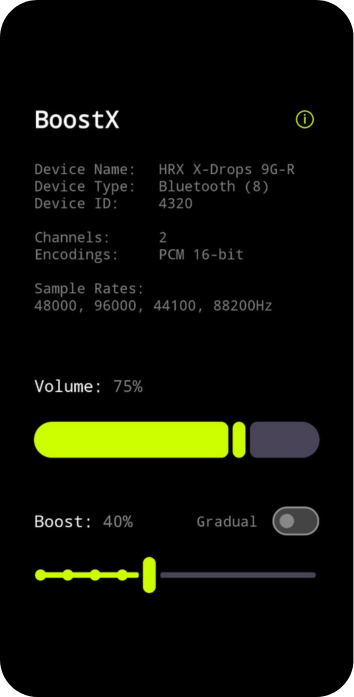
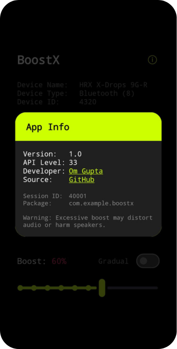
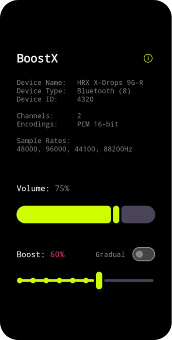
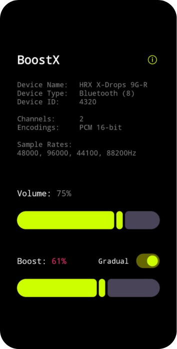

<div align="center">

# BoostX 


   

BoostX is a minimal yet powerful sound enhancement tool that allows users to boost audio levels beyond system limits with sliders for fine adjustments, and real-time audio device insights.
</div>


## Features

- Loudness boost using audio processing.
- Adjustable volume and boost sliders.
- Boost slider has two modes, discrete (default) and continuous (gradual) control. 
- Real-time audio insights displaying output device details.

## Screenshots

<div align="center">
   
   
   
   
</div>

## Download

BoostX will be available on F-Droid.

For now, the latest APK can be downloaded from [Releases](https://github.com/AumGupta/BoostX/releases).

## Development

### Tech Stack & Libraries Used

- Kotlin and Jetpack Compose.
- Android AudioManager and LoudnessEnhancer API for audio processing.
- Material 3 Components for consistent theming.

### How to Contribute

1. Fork the repository.
2. Clone your fork:
   ```sh
   git clone https://github.com/AumGupta/BoostX.git
   ```
3. Open the project in Android Studio, build, and test. 
4. Submit a Pull Request with your improvements.

## License
BoostX is licensed under the [GNU General Public License v3.0 (GPL-3.0)](https://github.com/AumGupta/BoostX?tab=GPL-3.0-1-ov-file).

## Support & Feedback
For suggestions, feature requests, or bug reports, open an issue on the [Issues](https://github.com/AumGupta/BoostX/issues) page.

If you find BoostX useful, consider starring the repository on GitHub.
