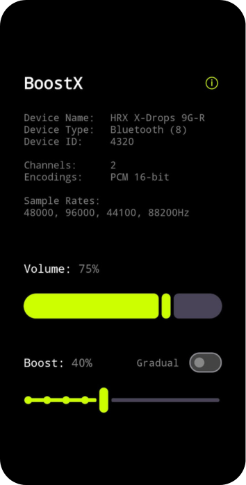
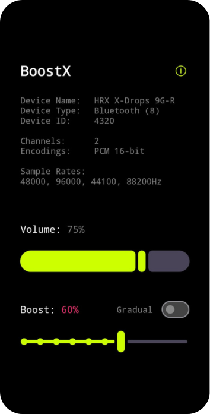
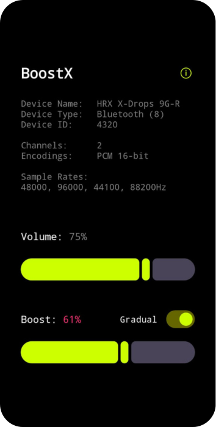

<div align="center">

# BoostX 


   

BoostX is a minimal yet powerful sound enhancement tool that allows users to boost audio levels beyond system limits with sliders for fine adjustments, and real-time audio device insights.
</div>


## Features

- Loudness boost using audio processing.
- Adjustable volume and boost sliders.
- Boost slider has two modes, discrete (default) and continuous (gradual) control. 
- Real-time audio insights displaying output device details.
- Optional **Start on Boot** — the boost is restored automatically after a reboot and stays
  active in the background, without the app UI being open.

## Start on Boot

Enable **Start on Boot** in the app to have your saved boost and volume reapplied
automatically after the device restarts.

When the toggle is on (or a boost is active), BoostX runs a small foreground service that owns
the audio effects, so the boost survives the UI being closed or swept out of recents. While it
is running you'll see a persistent low-priority notification — *"BoostX active — Keeping volume
boost at N%"* — which Android requires for any foreground service. Dismissing the boost from
the app stops the service and the notification with it.

Notes:

- On Android 13+ the app asks for the notification permission the first time it needs to show
  the service notification. If you deny it, the service still runs, but the notification is
  hidden.
- The service is declared as a `specialUse` foreground service. `mediaPlayback` is not usable
  here because Android 15 forbids starting that type from `BOOT_COMPLETED`.
- Some vendor ROMs aggressively kill background apps. If the boost doesn't come back after a
  reboot, exempt BoostX from battery optimisation in the system settings.

## Troubleshooting

**The boost stops working when I play music (LineageOS / AudioFX ROMs).**

System equalizers such as LineageOS' AudioFX attach their own effect to a music app's audio
session. When they do, AudioFlinger *suspends* global (session 0) effects — which is where
BoostX applies its boost — so the slider still shows a boost that you can no longer hear.

This is platform behaviour rather than a BoostX bug. Disabling AudioFX (or whatever system
equalizer your ROM ships) restores the boost.

## Screenshots

<div align="center">
   
   
   
</div>

## Download

BoostX will be available on F-Droid.

For now, the latest APK can be downloaded from [Releases](https://github.com/AumGupta/BoostX/releases).

## Development

### Tech Stack & Libraries Used

- Kotlin and Jetpack Compose.
- Android AudioManager and LoudnessEnhancer API for audio processing.
- Material 3 Components for consistent theming.

### How to Contribute

1. Fork the repository.
2. Clone your fork:
   ```sh
   git clone https://github.com/AumGupta/BoostX.git
   ```
3. Open the project in Android Studio, build, and test. 
4. Submit a Pull Request with your improvements.

## License
BoostX is licensed under the [GNU General Public License v3.0 (GPL-3.0)](https://github.com/AumGupta/BoostX?tab=GPL-3.0-1-ov-file).

## Support & Feedback
For suggestions, feature requests, or bug reports, open an issue on the [Issues](https://github.com/AumGupta/BoostX/issues) page.

If you find BoostX useful, consider starring the repository on GitHub.
